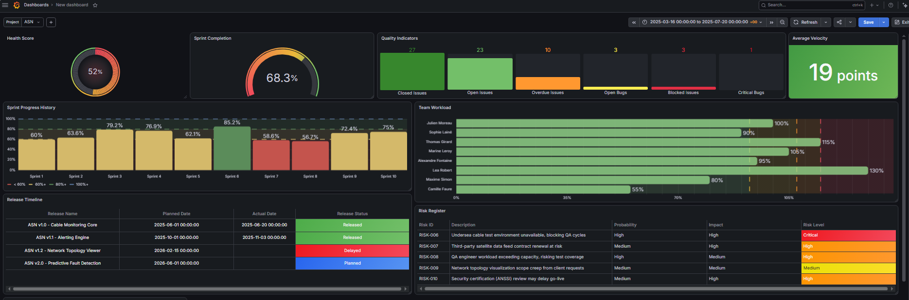

# JiraDashboardData

⚠️ **This repository contains entirely fictional, synthetically generated data.** Project names, client names, employee names, dates, and figures are all fabricated for demonstration purposes. No real company, client, employee, or project data is used or referenced anywhere in this repository.

A sample Jira-style dataset and Grafana dashboard for an executive-level software project management view, covering **three fictional client projects**.

This project was built as a prototype/demo: representative fake data stands in for a real Jira instance, so the dashboard can be developed, tested, and presented without depending on live company data. The architecture is designed so the data source can later be swapped for a real Jira connection with minimal changes to the dashboard itself.


---

## Repository structure

```
JiraDashboardData/
├── data/
│   ├── 01_projects.csv          # One row per project (3 fictional client projects)
│   ├── 02_sprints.csv           # Sprint history and progress per project
│   ├── 03_issues.csv            # 150+ issues across all three projects
│   ├── 04_team_members.csv      # Team roster, capacity, and workload
│   ├── 05_releases.csv          # Planned vs actual release dates
│   ├── 06_risks.csv             # Project risk register
│   └── 07_executive_kpis.csv    # Pre-aggregated KPIs per project
└── dashboards/
    └── project-health-dashboard.json   # Exported Grafana dashboard
```

---

## Data model

| File | Description | Key fields |
|---|---|---|
| `01_projects.csv` | Project metadata | Project ID, Client, PM, Status, Health Score |
| `02_sprints.csv` | Sprint-level planning vs delivery | Sprint ID, Planned/Completed Story Points, Progress % |
| `03_issues.csv` | Individual Jira-style issues | Issue Key, Type, Priority, Status, Assignee, Dates, Resolution Time |
| `04_team_members.csv` | Team roster and allocation | Name, Role, Team, Capacity %, Workload % |
| `05_releases.csv` | Release tracking | Release Name, Planned/Actual Date, Status |
| `06_risks.csv` | Risk register | Risk ID, Description, Probability, Impact, Risk Level |
| `07_executive_kpis.csv` | Roll-up metrics per project | Open/Closed Issues, Velocity, Overdue, Blocked, Health Score |

All KPIs in `07_executive_kpis.csv` are computed directly from the underlying issues/sprints data, not hand-entered, so the numbers stay internally consistent (e.g. Open Issues + Closed Issues = Total Issues).

Each of the three fictional projects has a short internal code used consistently across every file, so the dashboard's `Project` filter can select all related data at once.

---

## Dashboard

Built in **Grafana**, using the **Infinity data source plugin** to read the CSV files directly from this repo's raw GitHub URLs — no database required.

**Panels included:**
- Health Score (gauge)
- Sprint Completion (gauge)
- Quality Indicators (Closed/Open Issues, Overdue, Open Bugs, Blocked, Critical Bugs)
- Average Velocity
- Sprint Progress History (bar chart, severity-based coloring)
- Team Workload (capacity vs current allocation, per person)
- Release Timeline
- Risk Register (severity-sorted, color-coded by risk level)

A `Project` dropdown variable filters every panel to one of the three fictional projects.

### Importing the dashboard
1. Install Grafana (OSS is sufficient — no paid license needed)
2. Install the **Infinity** data source plugin
3. Add an Infinity data source pointing at this repo's raw CSV URLs, e.g.:
   ```
   https://raw.githubusercontent.com/Samya0/JiraDashboardData/main/data/01_projects.csv
   ```
4. In Grafana: **Dashboards → New → Import**, upload `dashboards/project-health-dashboard.json`
5. Map the dashboard's data source reference to your Infinity source when prompted

---

## From prototype to production

This dataset exists to demonstrate the dashboard without depending on a real company Jira project. The design intentionally keeps the swap to live data simple:

```
Prototype:   GitHub CSV  → Infinity → Grafana
Production:  Jira API    → Infinity → Grafana
```

Since Infinity can query REST APIs directly, moving to production means pointing the same data source at Jira's REST API (`/rest/api/3/search?jql=...`) with proper authentication, instead of swapping to a different plugin entirely. Panels, thresholds, and layout remain unchanged — only the query source changes.

---

## Disclaimer

All content in this repository — including but not limited to project names, client names, employee names, dates, story points, release dates, and risk descriptions — is entirely fictional and generated for demonstration purposes only. Any resemblance to real companies, projects, or individuals is coincidental. This repository is not affiliated with, endorsed by, or connected to any real organization.
